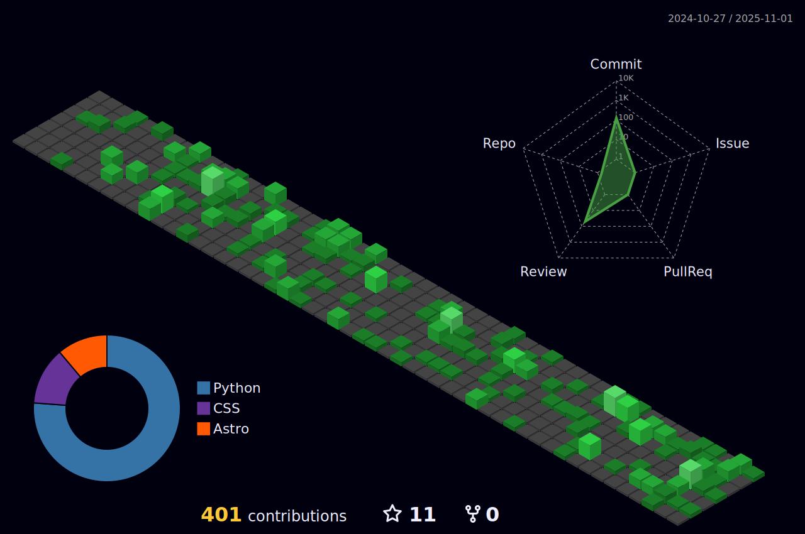

# 🧐 About Me

I'm 17 years old and a japanese student programmer.  I have practiced coding since March 2022.

I'm very interested in security technology.

 

# ⚡ Status

<!---->

 

# 🔧 Technologies

 - ## My Favorite

    

 - ## Currently Learning
    

 

# 🚀 Main Projects

 

# 📱 SNS

  
  
  

